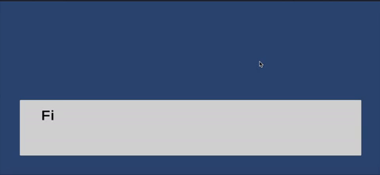

# Dialogue System

A modular Unity component to create dialogue.

## Features
- Reads dialogue letter by letter.

## Getting Started
1. **Copy the Dialogue folder** into your Unity project's `Assets/` directory.
2. **Add the DialogueBox prefab** to your scene.
3. **Add lines to its Dialogue script** to define your conversations.
4. **Customize the UI** as needed for your project.

## Usage
- Use the DialogueBox to start conversations.

## License
MIT
